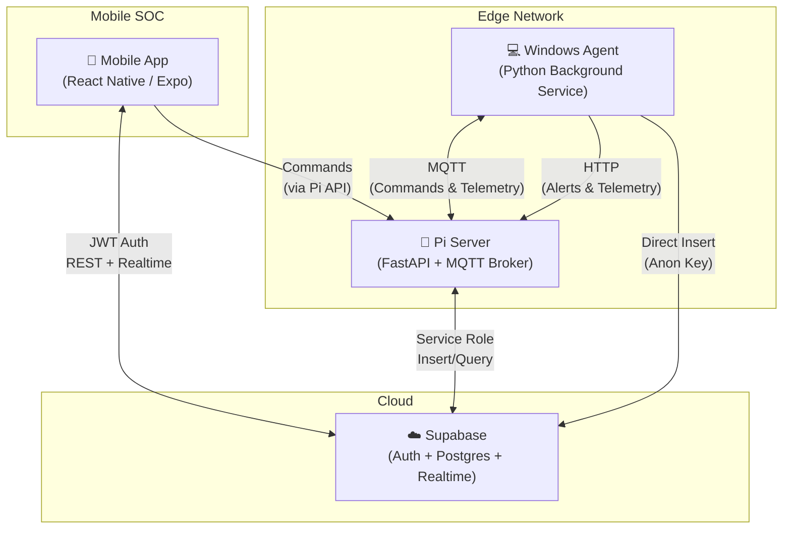
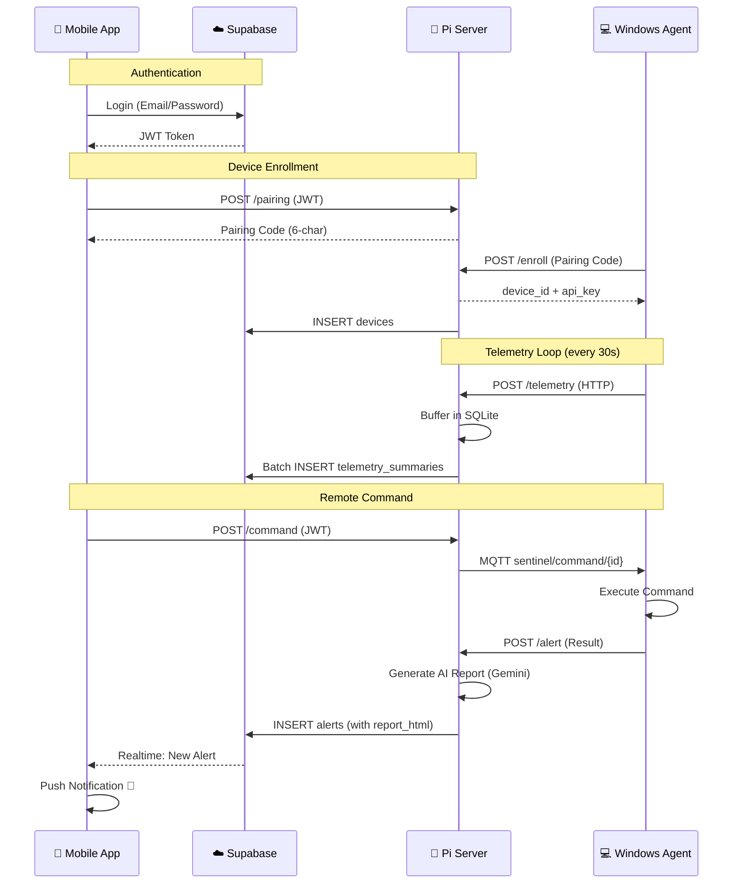
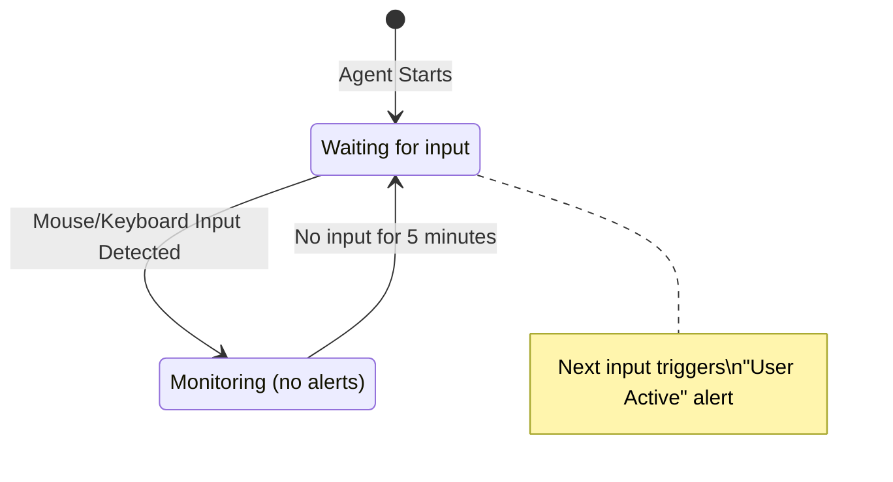

# SentinelPi EDR – Project Documentation

## 1. Project Overview

**SentinelPi EDR** (Endpoint Detection & Response) is a distributed cybersecurity monitoring platform designed as a lightweight, edge-first security solution. It enables real-time monitoring, threat scanning, and incident response for Windows endpoints, all managed through a mobile application.

The system follows a **three-tier architecture**:

1. **Windows Agent** — A Python-based background service installed on target Windows PCs that collects telemetry, runs malware scans, monitors user activity, and executes remote commands.
2. **Pi Server (Edge Server)** — A FastAPI application running on a Raspberry Pi (or any Linux host) that acts as the local command-and-control server, processing telemetry, generating AI-powered security reports, and relaying data to the cloud.
3. **Mobile App (SOC Console)** — A React Native (Expo) mobile application that serves as the Security Operations Center (SOC) interface, allowing the user to monitor devices, trigger scans, view AI-generated reports, and respond to alerts in real-time.



---

## 2. Features

### 2.1 Endpoint Monitoring & Telemetry
| Feature | Description |
|---|---|
| **CPU & Memory Monitoring** | Real-time CPU usage percentage, core count, memory total/available/percent via `psutil` |
| **Process Enumeration** | Lists all running processes with PID, name, username, command line, and creation time |
| **Network I/O Tracking** | Captures bytes/packets sent and received across all interfaces |
| **USB Device Detection** | Enumerates connected USB devices using PowerShell `Get-PnpDevice` |
| **Active Session Logging** | Records logged-in user sessions with host and start time |
| **Periodic Upload** | Telemetry is sent to the Pi Server every 30 seconds (configurable) |

### 2.2 Malware Scanning
| Feature | Description |
|---|---|
| **ClamAV Antivirus Scanning** | Recursive file scanning using `clamscan` with support for full PC, user profile, downloads, or custom path targets |
| **YARA Rule Matching** | Pattern-based malware detection using YARA rules (`yara64.exe`) for behavioral and signature-based analysis |
| **Real-time Download Monitoring** | Automatic scanning of new files in the Windows `Downloads` folder using `watchdog` filesystem events |
| **Quarantine / Removal** | Infected files can be automatically removed via ClamAV's `--remove` flag |
| **Scan Target Discovery** | Agent can discover all available drives and user profiles, uploading them to Supabase for the mobile app to select |

### 2.3 AI-Powered Security Reports
| Feature | Description |
|---|---|
| **Gemini AI Integration** | Uses Google's Gemini Pro API to generate human-readable HTML security reports |
| **Clean Scan Reports** | Green-themed reports with 6 sections: Overall Result, AI Insight, Scan Info, Findings, Interpretation, Recommendations |
| **Threat Detection Reports** | Red-themed reports highlighting specific threats, severity levels, and remediation steps |
| **Report Storage** | HTML reports are stored in the `metadata.report_html` field of the `alerts` table in Supabase |

### 2.4 User Activity Monitoring
| Feature | Description |
|---|---|
| **Input Detection** | Monitors mouse movements, clicks, scrolls, and keyboard presses using `pynput` |
| **Idle-to-Active Alerting** | Triggers a "User Active" alert only when transitioning from idle state (5 min default) to active, preventing alert spam |
| **Configurable Threshold** | Idle timeout is configurable via `ACTIVITY_IDLE_THRESHOLD_SECONDS` environment variable |

### 2.5 Remote Incident Response
| Feature | Description |
|---|---|
| **Remote Shutdown** | Immediately shuts down the target Windows PC |
| **Remote Restart** | Restarts the target PC |
| **Process Kill** | Terminates a specific process by PID using `taskkill` |
| **Network Isolation** | Disables all active network adapters via PowerShell to quarantine the device from the network |
| **Network Restore** | Re-enables previously disabled network adapters |

### 2.6 Device Enrollment & Pairing
| Feature | Description |
|---|---|
| **Pairing Code System** | Time-limited (5 min TTL) 6-character alphanumeric codes generated by the Pi Server |
| **Secure Enrollment** | Agent exchanges pairing code for a unique `device_id` and `api_key` |
| **Credential Storage** | Credentials stored securely using Windows Keyring (`keyring`) with JSON file fallback |
| **Device Registration** | Enrolled devices are registered in both local SQLite store and Supabase `devices` table |

### 2.7 Real-time Alerts & Notifications
| Feature | Description |
|---|---|
| **Supabase Realtime** | Mobile app subscribes to Supabase Postgres Changes for instant alert delivery |
| **Push Notifications** | Local notifications via `expo-notifications` with custom Android notification channels |
| **Suspicious Process Detection** | Server-side keyword matching against known attack tools (Mimikatz, encoded PowerShell, Certutil, Bitsadmin) |
| **Audit Logging** | All commands sent from the mobile app are logged in Supabase `audit_logs` table |

### 2.8 Mobile Dashboard
| Feature | Description |
|---|---|
| **Device Overview** | View all enrolled devices with status indicators |
| **Telemetry Visualization** | CPU/Memory graphs via `react-native-chart-kit` |
| **Scan Controls** | Trigger targeted scans (Full PC, User Profile, Downloads, Custom Path) |
| **Alert Management** | View, tap-to-expand, and clear alerts with HTML report rendering via WebView |
| **Settings & Configuration** | Pi Server IP configuration, user authentication, and logout |

---

## 3. Technology Stack

### 3.1 Windows Agent
| Technology | Purpose |
|---|---|
| **Python 3.12** | Core runtime |
| **psutil 6.0** | System telemetry collection (CPU, memory, processes, network, users) |
| **paho-mqtt 2.1** | MQTT client for bidirectional communication with Pi Server |
| **watchdog 4.0** | Filesystem event monitoring for real-time download scanning |
| **pynput 1.7** | Mouse/keyboard input monitoring for user activity detection |
| **supabase-py** | Direct Supabase client for uploading discovered paths |
| **keyring 25.3** | Secure credential storage via Windows Credential Manager |
| **pywin32 306** | Windows API access for system operations |
| **PySide6 6.7** | System tray UI (Qt-based) |
| **ClamAV** | Open-source antivirus engine (external binary) |
| **YARA** | Pattern-matching malware detection engine (external binary) |

### 3.2 Pi Server (Edge Server)
| Technology | Purpose |
|---|---|
| **Python 3.11+** | Core runtime |
| **FastAPI 0.115** | High-performance async REST API framework |
| **Uvicorn 0.30** | ASGI server for FastAPI |
| **Pydantic v2** | Data validation and settings management |
| **paho-mqtt** | MQTT client for subscribing to device telemetry/heartbeats |
| **Mosquitto** | MQTT broker (installed on the Pi) |
| **httpx 0.27** | Async HTTP client for Supabase REST API calls |
| **aiosqlite 0.20** | Async SQLite for local telemetry buffering |
| **google-generativeai 0.8** | Gemini Pro API for AI-powered report generation |

### 3.3 Mobile App
| Technology | Purpose |
|---|---|
| **React Native 0.81** | Cross-platform mobile framework |
| **Expo SDK 54** | Development toolchain and managed workflow |
| **TypeScript 5.9** | Type-safe development |
| **@supabase/supabase-js** | Supabase client (Auth, Realtime, REST) |
| **@react-navigation** | Stack + Bottom Tab navigation |
| **expo-notifications** | Local push notifications for security alerts |
| **expo-secure-store** | Encrypted storage for auth tokens |
| **react-native-webview** | HTML report rendering |
| **react-native-chart-kit** | Telemetry data visualization (CPU/Memory graphs) |
| **react-native-svg** | SVG rendering for charts |
| **date-fns** | Date/time formatting |
| **axios** | HTTP client for Pi Server API calls |

### 3.4 Cloud Services
| Technology | Purpose |
|---|---|
| **Supabase (PostgreSQL)** | Primary cloud database for devices, alerts, telemetry summaries, paths, audit logs |
| **Supabase Auth** | JWT-based user authentication |
| **Supabase Realtime** | WebSocket-based real-time data sync for alerts |
| **Google Gemini Pro** | AI model for security report generation |

---

## 4. System Architecture

### 4.1 Communication Protocols



### 4.2 Data Flow Summary

| Flow | Protocol | Direction |
|---|---|---|
| Mobile ↔ Supabase | HTTPS + WebSocket (Realtime) | Bidirectional |
| Mobile → Pi Server | HTTP REST | Mobile initiates |
| Pi Server → Supabase | HTTPS (Service Role Key) | Server-to-cloud |
| Agent ↔ Pi Server (Commands) | MQTT (port 1883) | Bidirectional |
| Agent → Pi Server (Telemetry) | HTTP POST | Agent uploads |
| Agent → Supabase (Paths) | HTTPS (Anon Key) | Direct insert |

### 4.3 Trust Boundaries
- **Pi Server** is authoritative for local incident response and command routing
- **Supabase** is authoritative for identity (auth) and global data visibility
- **Agents never accept commands from the cloud directly** — all commands are routed through the Pi Server via MQTT

---

## 5. Core Algorithms

### 5.1 Suspicious Process Detection (Server-Side)

```
Location: pi_server/app/services/detection.py
Algorithm: Keyword-Based Pattern Matching
```

The `DetectionEngine` scans process telemetry against a blocklist of known attack tool keywords:

```python
SUSPICIOUS_PROCESS_KEYWORDS = [
    "mimikatz",       # Credential dumping tool
    "rundll32",       # Often used for DLL sideloading
    "powershell -enc", # Encoded PowerShell (obfuscation indicator)
    "certutil",       # Certificate utility (used for downloading payloads)
    "bitsadmin",      # Background transfer (used for downloading payloads)
]
```

**Algorithm:**
1. For each process in telemetry payload, extract `name` and `cmdline`
2. Normalize to lowercase
3. Check if any keyword appears as a substring
4. If matched → generate `severity: high` alert with process metadata

### 5.2 Scan Result Filtering (Agent-Side)

```
Location: windows_agent/app/services/commands.py → filter_output()
Algorithm: Log Line Classification
```

Raw ClamAV/YARA output is filtered to extract only security-relevant lines:

1. Split output into lines
2. Keep lines containing: `FOUND`, `DETECTED`, `ERROR`, `Scanned`, `Infected`, `Data scanned`, `Time`
3. Truncate to first 100 matches to limit token usage for AI report generation

### 5.3 AI Report Generation (Server-Side)

```
Location: pi_server/app/services/ml_service.py
Algorithm: LLM-Powered Report Synthesis
```

1. Extract ClamAV and YARA output from alert metadata
2. Pre-filter logs: remove `OK` lines, keep only interesting lines (max 50)
3. **Branch Decision:**
   - If both ClamAV and YARA report "No threats detected" → Use **Clean Report Template** (green theme, 6-section format)
   - Otherwise → Use **Threat Report Template** (red theme, threat extraction)
4. Send structured prompt with HTML template to **Google Gemini Pro**
5. AI fills in dynamic sections (scan date, specific files, threat details) from actual log data
6. Return generated HTML, stored in `metadata.report_html` of the alert

### 5.4 User Activity Detection (Agent-Side)

```
Location: windows_agent/app/services/activity_monitor.py
Algorithm: Idle-State Transition Detection
```



1. Agent starts in `IDLE` state
2. `pynput` listeners monitor mouse (move/click/scroll) and keyboard (press/release)
3. On any input:
   - If currently IDLE → Transition to ACTIVE and trigger `user_active` alert callback
   - Update `last_activity` timestamp
4. Background thread checks every 5 seconds:
   - If ACTIVE and `now - last_activity > idle_threshold` → Transition back to IDLE
5. This prevents alert spam: only ONE alert per idle→active transition

### 5.5 Telemetry Buffering & Batch Upload

```
Location: pi_server/app/main.py → flush_telemetry_loop()
Algorithm: Store-and-Forward with Batch Processing
```

1. Agent sends telemetry to Pi Server every 30 seconds
2. Pi Server buffers telemetry in local SQLite database (`aiosqlite`)
3. Every 5 seconds, a background task:
   - Fetches up to 100 buffered entries
   - Transforms raw telemetry into summary format (CPU, memory, process count)
   - Batch inserts into Supabase `telemetry_summaries` table
   - Deletes successfully uploaded entries from local buffer
4. On failure (e.g., foreign key violation), logs error and retries in next cycle

### 5.6 Device Pairing Protocol

```
Location: pi_server/app/services/pairing.py + routes/pairing.py
Algorithm: Time-Limited Code Exchange
```

1. **Mobile App** → Authenticated user requests pairing code from Pi Server
2. **Pi Server** → Generates 6-character alphanumeric code using `secrets.choice()` with 5-minute TTL
3. User physically enters the code on the Windows Agent
4. **Agent** → Sends pairing code + hostname to Pi Server's `/enroll` endpoint
5. **Pi Server** → Verifies code hasn't expired, generates UUID `device_id` + hex `api_key`
6. Registers device in both local SQLite and Supabase
7. Consumes (deletes) the pairing code to prevent reuse
8. Agent stores credentials in Windows Keyring

### 5.7 Supabase REST Client (Server-Side)

```
Location: pi_server/app/supabase_client.py
Algorithm: Retry-With-Backoff HTTP Client
```

- Custom async HTTP client using `httpx`
- All requests include Service Role Key for elevated permissions
- **Retry logic**: Up to 3 attempts with exponential backoff (0.5s × attempt) on 5xx errors
- Supports `INSERT`, `UPDATE`, `DELETE` operations via Supabase REST API

---

## 6. Database Schema (Supabase)

| Table | Purpose | Key Columns |
|---|---|---|
| `devices` | Enrolled device registry | `device_id`, `device_hostname`, `agent_version`, `status`, `created_at` |
| `alerts` | Security alerts & AI reports | `device_id`, `timestamp`, `severity`, `title`, `description`, `metadata` (JSONB with `report_html`) |
| `telemetry_summaries` | Aggregated system metrics | `device_id`, `timestamp`, `summary` (JSONB: cpu, memory, process_count) |
| `device_paths` | Discovered scan targets | `device_id`, `path`, `label`, `is_directory`, `last_updated` |
| `pairing_codes` | Active pairing sessions | `pairing_code`, `device_name`, `expires_at`, `created_by` |
| `audit_logs` | Command execution history | `device_id`, `action`, `actor`, `timestamp` |

---

## 7. Project Structure

```
SentinelPi/
├── windows_agent/              # Windows Endpoint Agent
│   ├── app/
│   │   ├── main.py             # Entry point (asyncio runner)
│   │   ├── agent.py            # Core AgentClient class
│   │   ├── config.py           # Environment-based configuration
│   │   ├── service.py          # Windows service wrapper
│   │   └── services/
│   │       ├── commands.py     # Command executor (scan, shutdown, isolate)
│   │       ├── telemetry.py    # System metrics collector (psutil)
│   │       ├── file_watcher.py # Downloads folder monitor (watchdog)
│   │       ├── activity_monitor.py  # User input detector (pynput)
│   │       └── credentials.py  # Keyring + file credential store
│   └── requirements.txt
│
├── pi_server/                  # Edge Server (Raspberry Pi)
│   ├── app/
│   │   ├── main.py             # FastAPI application + telemetry flush
│   │   ├── config.py           # Pydantic settings
│   │   ├── auth.py             # API key verification
│   │   ├── supabase_client.py  # Async Supabase REST wrapper
│   │   ├── routes/
│   │   │   ├── agent.py        # /telemetry, /alert endpoints
│   │   │   ├── command.py      # /command endpoint (MQTT dispatch)
│   │   │   ├── pairing.py      # /pairing, /enroll endpoints
│   │   │   └── health.py       # /health endpoint
│   │   ├── services/
│   │   │   ├── detection.py    # Keyword-based suspicious process detection
│   │   │   ├── ml_service.py   # Gemini AI report generator
│   │   │   ├── mqtt_service.py # MQTT broker integration
│   │   │   ├── pairing.py      # Pairing code lifecycle manager
│   │   │   └── ws_manager.py   # WebSocket connection manager
│   │   └── storage/
│   │       ├── telemetry_buffer.py  # SQLite telemetry buffer
│   │       └── device_store.py      # Local device registry
│   └── requirements.txt
│
├── mobile_app_new/             # Mobile SOC Application
│   ├── App.tsx                 # Root: Navigation + Notifications
│   ├── src/
│   │   ├── screens/
│   │   │   ├── DashboardScreen.tsx    # Main dashboard + scan controls
│   │   │   ├── AlertsScreen.tsx       # Alert list + HTML report viewer
│   │   │   ├── DevicesScreen.tsx      # Device list + management
│   │   │   ├── DeviceControlScreen.tsx # Remote commands
│   │   │   ├── DeviceTelemetryScreen.tsx # CPU/Memory graphs
│   │   │   ├── LoginScreen.tsx        # Supabase auth
│   │   │   ├── SignupScreen.tsx       # Registration
│   │   │   ├── PiConfigScreen.tsx     # Pi Server IP setup
│   │   │   ├── PairingScreen.tsx      # Device pairing
│   │   │   ├── SettingsScreen.tsx     # App settings
│   │   │   └── SplashScreen.tsx       # Launch animation
│   │   ├── api/
│   │   │   ├── supabase.ts        # Supabase client init
│   │   │   ├── supabaseRest.ts    # REST helper (GET/POST/DELETE)
│   │   │   └── pi.ts              # Pi Server API wrapper
│   │   ├── navigation/
│   │   │   └── MainTabNavigator.tsx  # Bottom tab navigation
│   │   ├── state/
│   │   │   └── secureStore.ts     # Secure token storage
│   │   └── ui/
│   │       └── theme.ts          # Dark theme configuration
│   └── package.json
│
├── clamav/                     # ClamAV antivirus binaries
├── scripts/                    # Deployment scripts
│   ├── install_mqtt.sh         # Mosquitto broker setup
│   ├── install_pi.sh           # Pi Server dependencies
│   └── install_windows.ps1     # Windows Agent setup
├── supabase_db_scripts/        # Database migration scripts
└── docs/                       # Documentation
    ├── ARCHITECTURE.md
    ├── DEPLOYMENT.md
    ├── HARDENING.md
    ├── MIGRATION.md
    └── TESTING.md
```

---

## 8. Environment Configuration

### Windows Agent (`.env`)
| Variable | Default | Description |
|---|---|---|
| `PI_SERVER_IP` | `127.0.0.1` | IP address of the Pi Server |
| `PI_SERVER_PORT` | `8000` | Pi Server HTTP port |
| `MQTT_BROKER_PORT` | `1883` | MQTT broker port |
| `TELEMETRY_INTERVAL_SECONDS` | `30` | Telemetry upload frequency |
| `HEARTBEAT_INTERVAL_SECONDS` | `60` | MQTT heartbeat frequency |
| `ACTIVITY_IDLE_THRESHOLD_SECONDS` | `300` | Idle timeout before activity alert triggers |
| `CLAMAV_PATH` | `clamscan.exe` | Path to ClamAV binary |
| `YARA_PATH` | `yara64.exe` | Path to YARA binary |
| `EXPO_PUBLIC_SUPABASE_URL` | — | Supabase project URL |
| `EXPO_PUBLIC_SUPABASE_ANON_KEY` | — | Supabase anonymous key |

### Pi Server (`.env`)
| Variable | Default | Description |
|---|---|---|
| `SENTINELPI_HOST` | `0.0.0.0` | Server bind address |
| `SENTINELPI_PORT` | `8000` | Server port |
| `SENTINELPI_SUPABASE_URL` | — | Supabase project URL |
| `SENTINELPI_SUPABASE_SERVICE_ROLE_KEY` | — | Supabase service role key |
| `SENTINELPI_SUPABASE_ANON_KEY` | — | Supabase anonymous key |
| `SENTINELPI_GEMINI_API_KEY` | — | Google Gemini API key for AI reports |
| `SENTINELPI_TELEMETRY_FLUSH_INTERVAL_SECONDS` | `5` | Batch upload frequency |

---

## 9. Security Considerations

- **Zero-Trust Agent Design**: Agents never accept commands from the cloud. All commands are routed through the locally-controlled Pi Server via MQTT.
- **API Key Authentication**: Each enrolled device has a unique API key verified by the Pi Server for every request.
- **JWT Verification**: Mobile app commands are verified against Supabase JWT tokens before execution.
- **Credential Encryption**: Agent credentials are stored in Windows Credential Manager (keyring) with a JSON file fallback.
- **Row Level Security (RLS)**: Supabase tables have RLS policies controlling access for authenticated and anonymous roles.
- **Audit Logging**: All remote commands are logged with actor ID and timestamp for accountability.
- **Network Isolation**: Ability to instantly disconnect compromised endpoints from the network.

---

*Generated for SentinelPi EDR v1.0.0 — Automated Proactive Threat Defense*
